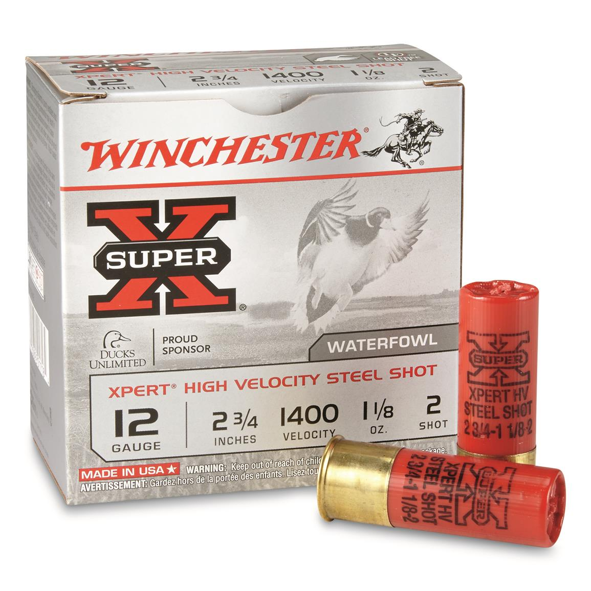
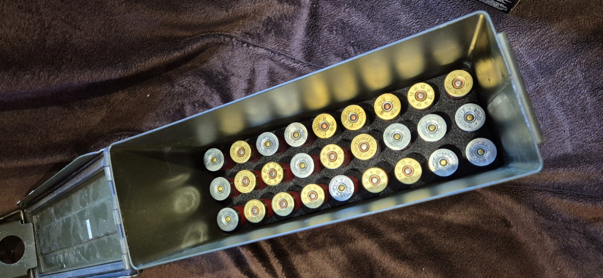
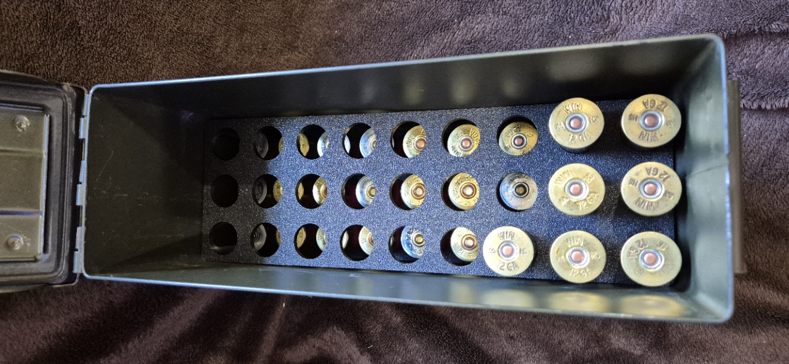
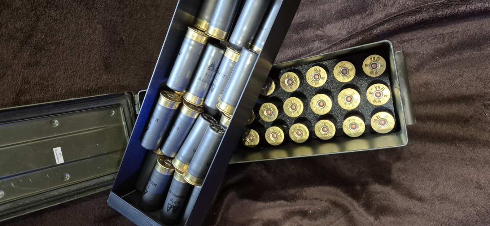
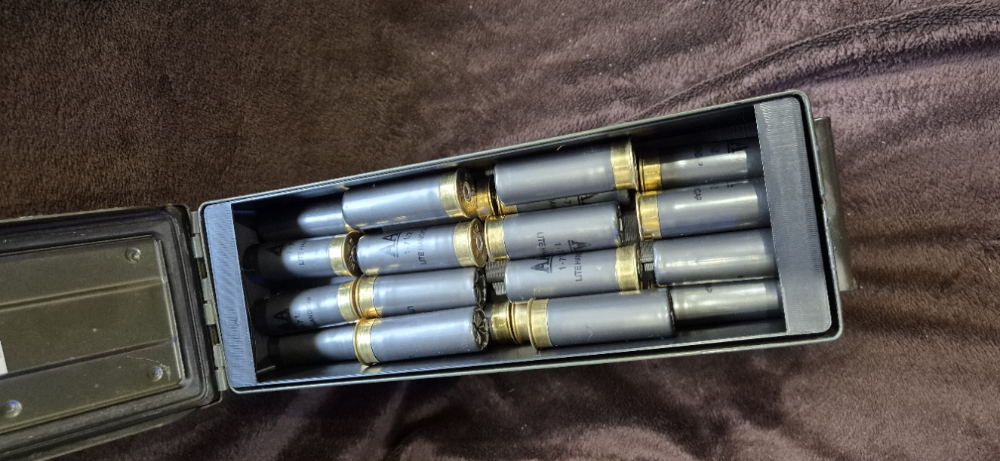

# AmmoBoxInsert
Military Ammo Box Insert for 12 Gauge shells (2-3/4")

## What is this?

Just a simple design to take these

and fit them inside this

neatly

and thats it really

There's a tray to hold 27 shells vertically and a top tray for loose shells (the lid gets too close to add a third tray)

knocked up on a super hot summers day due to boredom

 

 

 

## Contents

- Fusion 360 files 
- bambu studio 3mf profile
- exported stl's
- various images 
- may contain gluten

## I wanna help!

Fork, edit & create a pull request!

## Links

Also found <a href="https://makerworld.com/en/models/953130#profileId-921539">here!</a>

